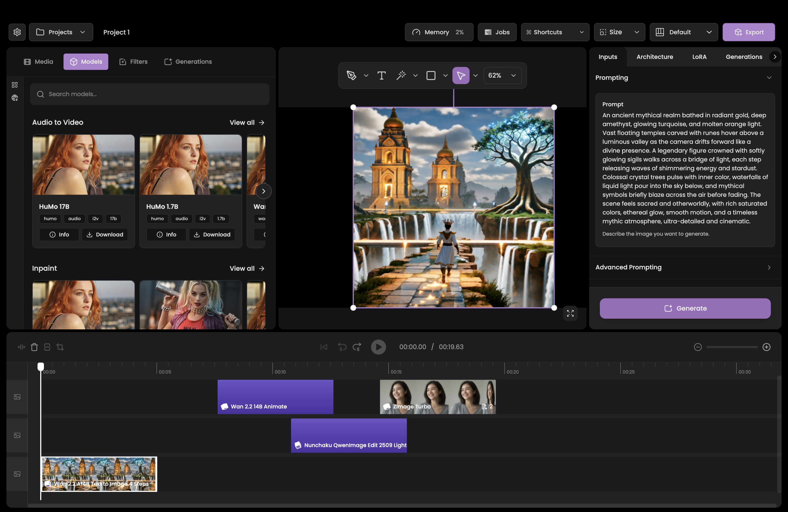

<h1 align="center">Apex Studio</h1>
<p align="center">Effortless Open-Source Content Creation. </p>
<p align="center">
  
</p>

<p align="center">
  Apex was built around a simple belief: using free and open-source diffusion models should feel effortless. Making the model run shouldn’t be the challenge, the challenge should be the ambition, depth, and complexity of the content you choose to create.
</p>

## 🚀Quick Start

- Packaged application
- Available for MacOS and Windows machines

## Run locally (development)

### Prerequisites

- **Node.js 24.x** (required)
- **Python** (for `apex-engine`)

### 1) Start the desktop app (Electron)

From the app workspace:

```bash
cd apps/app
npm i
npm start
```

### 2) Install + run the engine (`apex-engine`)

From the API workspace, install Python deps and the `apex-engine` CLI.

#### Option A (recommended): use the dev pip installer (venv or current env)

```bash
cd apps/api

# New virtualenv (recommended)
python3 -m venv .venv
source .venv/bin/activate

# Install deps + apex-engine (pick one: mps/cpu/cuda-sm80-ampere/cuda-sm89-ada/cuda-sm90-hopper/cuda-sm100-blackwell/rocm)
python3 scripts/dev_pip_install.py --machine mps
```

Then run the engine:

```bash
cd apps/api
apex-engine dev

# Or:
# python3 -m src serve
```

#### Option B: manual pip install (current environment)

```bash
cd apps/api
python3 -m pip install -U pip setuptools wheel
python3 -m pip install honcho

# Install torch (pick one)
python3 -m pip install torch torchvision torchaudio
# python3 -m pip install --index-url https://download.pytorch.org/whl/cpu torch torchvision torchaudio

# Install global requirements
python3 -m pip install -r requirements.txt

# Install platform requirements (pick one)
python3 -m pip install -r requirements/machines/mps.txt
# python3 -m pip install -r requirements/machines/cpu.txt

# Install the CLI entrypoint
python3 -m pip install -e . --no-deps
```

Then run:

```bash
cd apps/api
apex-engine dev
```

### Nunchaku
If you your machine supports using the Nunchakue models, you can install the Nunchaku models by running the following command:
```bash
python3 scripts/maybe_install_nunchaku.py --install
```
Which will install the Nunchaku models if your machine supports it.

### Optional: Rust-accelerated downloader (for max download throughput)

`src/mixins/download_mixin.py` can use an optional Rust/PyO3 module (`apex_download_rs`) for faster URL downloads
(less Python overhead, better chance of saturating network/disk).

Build/install (requires Rust toolchain + cargo):

```bash
python -m pip install -U pip maturin
cd rust/apex_download_rs
maturin develop --release
```

Runtime toggles:
- `APEX_USE_RUST_DOWNLOAD=0` to disable (default is enabled if the module is importable)
- `APEX_DOWNLOAD_PROGRESS_INTERVAL` (seconds, default `0.2`) to throttle progress callbacks
- `APEX_DOWNLOAD_PROGRESS_MIN_BYTES` (bytes, default `1048576`) to throttle progress callbacks

Rust parallel range-download tuning (hf_transfer-style, signature unchanged; all optional):
- `APEX_RUST_DOWNLOAD_MAX_FILES` (default `8`): max concurrent range requests / file handles
- `APEX_RUST_DOWNLOAD_PARALLEL_FAILURES` (default `0`) + `APEX_RUST_DOWNLOAD_MAX_RETRIES` (default `0`): enable per-chunk retry with backoff
- `APEX_RUST_DOWNLOAD_RETRY_BASE_MS` (default `300`) and `APEX_RUST_DOWNLOAD_RETRY_MAX_MS` (default `10000`)


## Features

<hr />

- Video editor built with JavaScript and Electron for easy video creation, and timeline based editing.
- Easy preprocessing by dragging your desired preprocessor model onto a media clip.
- Point-based masking with positive and negative markers for precise, intuitive control over exactly what gets masked.
- Use any LoRA from popular model hubs like Hugging Face or Civitai—bring your own checkpoints, styles, and character LoRAs and plug them directly into your workflow.
- Projects are saved as simple JSON files, making them easy to version, hand-edit and share
- No node graphs: projects stay straightforward and portable, improving cross-compatibility across machines, setups, and collaborators.
- Built-in queueing so you can line up multiple renders/generations and let Apex process them in order.
- Denoised latent previews at predetermined intervals, so you can watch generations evolve as they render.
- Built-in video controls including speed changes, frame interpolation, and keyframe selection.
- Editing controls for trimming, slicing, cropping, and much more.
- Hundreds of effects available to use within your creation.
- Audio controls including detaching audio from video, waveform manipulation, noise reduction, and more.

### Models

- **Image Models**
  - [Chroma HD Text To Image](apps/api/manifest/image/chroma-hd-text-to-image-1.0.0.v1.yml)
  - [Flux Dev Fill](apps/api/manifest/image/flux-dev-fill-1.0.0.v1.yml)
  - [Flux Dev Kontext](apps/api/manifest/image/flux-dev-kontext-1.0.0.v1.yml)
  - [Flux Dev Text To Image](apps/api/manifest/image/flux-dev-text-to-image-1.0.0.v1.yml)
  - [Flux Krea Text To Image](apps/api/manifest/image/flux-krea-text-to-image-1.0.0.v1.yml)
  - [Flux2 Dev Text To Image Edit](apps/api/manifest/image/flux2-dev-text-to-image-edit-1.0.0.v1.yml)
  - [Flux2 Dev Text To Image Edit Turbo](apps/api/manifest/image/flux2-dev-text-to-image-edit-turbo-1.0.0.v1.yml)
  - [Nunchaku Flux Dev Kontext](apps/api/manifest/image/nunchaku-flux-dev-kontext-1.0.0.v1.yml)
  - [Nunchaku Flux Dev Text To Image](apps/api/manifest/image/nunchaku-flux-dev-text-to-image-1.0.0.v1.yml)
  - [Nunchaku Flux Krea Text To Image](apps/api/manifest/image/nunchaku-flux-krea-text-to-image-1.0.0.v1.yml)
  - [Nunchaku QwenImage Edit 2509 Lightning 8 Steps](apps/api/manifest/image/nunchaku-qwenimage-edit-2509-lightning-8steps-1.0.0.v1.yml)
  - [Nunchaku QwenImage Edit Lightning 8 Steps](apps/api/manifest/image/nunchaku-qwenimage-edit-lightning-8steps-1.0.0.v1.yml)
  - [Nunchaku QwenImage Lightning 8 Steps](apps/api/manifest/image/nunchaku-qwenimage-lightning-8steps-1.0.0.v1.yml)
  - [QwenImage](apps/api/manifest/image/qwenimage-1.0.0.v1.yml)
  - [QwenImage Edit](apps/api/manifest/image/qwenimage-edit-1.0.0.v1.yml)
  - [QwenImage Edit 2509](apps/api/manifest/image/qwenimage-edit-2509-1.0.0.v1.yml)
  - [QwenImage Edit 2511](apps/api/manifest/image/qwenimage-edit-2511-1.0.0.v1.yml)
  - [SRPO Text To Image](apps/api/manifest/image/srpo-text-to-image-1.0.0.v1.yml)
  - [Wan 2.2 A14B Text To Image](apps/api/manifest/image/wan-2.2-a14b-text-to-image-1.0.0.v1.yml)
  - [ZImage Turbo](apps/api/manifest/image/zimage-turbo-1.0.0.v1.yml)
  - [ZImage Turbo Control](apps/api/manifest/image/zimage-turbo-control-1.0.0.v1.yml)

- **Video Models**
  - [HUMO 17B](apps/api/manifest/video/humo-17b-1.0.0.v1.yml)
  - [HunyuanVideo 1.5 I2V](apps/api/manifest/video/hunyuanvideo-1.5-i2v-1.0.0.v1.yml)
  - [HunyuanVideo 1.5 T2V](apps/api/manifest/video/hunyuanvideo-1.5-t2v-1.0.0.v1.yml)
  - [OVI 10B 10S](apps/api/manifest/video/ovi-10b-10s-1.0.0.v1.yml)
  - [OVI 10B 5S](apps/api/manifest/video/ovi-10b-5s-1.0.0.v1.yml)
  - [Wan 2.1 14B Image To Video 480P](apps/api/manifest/video/wan-2.1-14b-image-to-video-480p-1.0.0.v1.yml)
  - [Wan 2.1 14B InfiniTalk](apps/api/manifest/video/wan-2.1-14b-infinitetalk-1.0.0.v1.yml)
  - [Wan 2.1 14B MultiTalk](apps/api/manifest/video/wan-2.1-14b-multitalk-1.0.0.v1.yml)
  - [Wan 2.1 14B SCAIL](apps/api/manifest/video/wan-2.1-14b-scail-1.0.0.v1.yml)
  - [Wan 2.1 14B Text To Video](apps/api/manifest/video/wan-2.1-14b-text-to-video.yml)
  - [Wan 2.1 14B VACE Control](apps/api/manifest/video/wan-2.1-14b-vace-control-1.0.0.v1.yml)
  - [Wan 2.1 14B VACE Expand Swap](apps/api/manifest/video/wan-2.1-14b-vace-expand-swap-1.0.0.v1.yml)
  - [Wan 2.1 14B VACE Painting](apps/api/manifest/video/wan-2.1-14b-vace-painting-1.0.0.v1.yml)
  - [Wan 2.1 14B VACE Reference To Video](apps/api/manifest/video/wan-2.1-14b-vace-reference-to-video-1.0.0.v1.yml)
  - [Wan 2.2 14B Animate](apps/api/manifest/video/wan-2.2-14b-animate-1.0.0.v1.yml)
  - [Wan 2.2 14B Speech To Video](apps/api/manifest/video/wan-2.2-14b-speech-to-video-1.0.0.v1.yml)
  - [Wan 2.2 5B Text To Image To Video Turbo](apps/api/manifest/video/wan-2.2-5b-text-to-image-to-video-turbo.1.0.0.v1.yml)
  - [Wan 2.2 A14B Text To Video](apps/api/manifest/video/wan-2.2-a14b-text-to-video-1.0.0.v1.yml)
  - [Wan 2.2 Fun A14B Control](apps/api/manifest/video/wan-2.2-fun-a14b-control-1.0.0.v1.yml)
  - [Wan 2.2 Fun A14B VACE](apps/api/manifest/video/wan-2.2-fun-a14b-vace-1.0.0.v1.yml)
  - [Wan Lynx 14B](apps/api/manifest/video/wan-lynx-14b-1.0.0.v1.yml)
  - [Wan Lynx Lite 14B](apps/api/manifest/video/wan-lynx-lite-14b-1.0.0.v1.yml)
  - [Wan 2.2 A14B First Frame Last Frame](apps/api/manifest/video/wan2.2-a14b-first-frame-last-frame-1.0.0.v1.yml)
  - [Wan 2.2 A14B Image To Video](apps/api/manifest/video/wan2.2-a14b-image-to-video-1.0.0.v1.yml)
  - [Wan 2.2 A14B Stable Video Infinity](apps/api/manifest/video/wan2.2-a14b-stable-video-infinity-1.0.0.v1.yml)
  - [LTX 2.0 TI2V Distilled](apps/api/manifest/video/ltx2-19b-text-to-image-to-video-distilled-1.0.0.v1.yml)
  - [LTX 2.0 TI2V](apps/api/manifest/video/ltx2-19b-text-to-image-to-video-1.0.0.v1.yml)
- **Upscalers**
  - [FlashVSR 1.1 Full](apps/api/manifest/upscalers/flashvsr-1.1-full.yml)
  - [FlashVSR 1.1 Tiny](apps/api/manifest/upscalers/flashvsr-1.1-tiny.yml)
  - [SeedVR2 3B](apps/api/manifest/upscalers/seedvr2-3b.yml)
  - [SeedVR2 7B](apps/api/manifest/upscalers/seedvr2-7b.yml)


