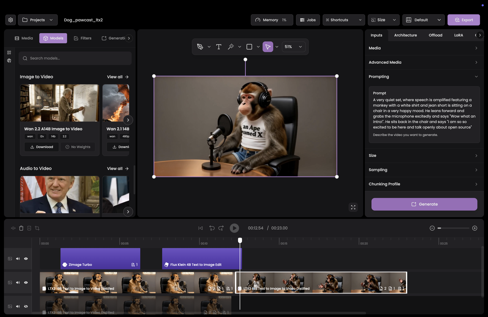

<h1 align="center">Apex Studio</h1>

Effortless Open-Source Content Creation. 

  

  

  Apex was built around a simple belief: using free and open-source diffusion models should feel effortless. Making the model run shouldn’t be the challenge, the challenge should be the ambition, depth, and complexity of the content you choose to create.

## 📦 Download & Install

The fastest and easiest way to use Apex Studio is to download the latest release for your operating system. For users who prefer a pre-packaged backend (API and Python environment), you can find optimized bundles on [Hugging Face](https://huggingface.co/totoku/apex-studio-server/tree/main).

| Platform | Download |
| :--- | :--- |
| **Windows** | [Download .exe (x64)](https://github.com/totokunda/apex-studio/releases/download/v0.1.2/apex-studio-0.1.2-win-x64-setup.exe) |
| **macOS** | [Download .dmg (Apple Silicon)](https://github.com/totokunda/apex-studio/releases/download/v0.1.2/apex-studio-0.1.2-mac-arm64.dmg) / [Download .dmg (Intel)](https://github.com/totokunda/apex-studio/releases/download/v0.1.2/apex-studio-0.1.2-mac-x64.dmg) |
| **Linux** | [Download .deb](https://github.com/totokunda/apex-studio/releases/download/v0.1.2/apex-studio-0.1.2-linux-amd64.deb) / [Download .AppImage](https://github.com/totokunda/apex-studio/releases/download/v0.1.2/Apex-Studio-0.1.2-x86_64.AppImage) / [Download .tar.gz](https://github.com/totokunda/apex-studio/releases/download/v0.1.2/apex-studio-0.1.2-linux-x64.tar.gz) |

For other versions or to see the changelog, visit our [GitHub Releases](https://github.com/totokunda/apex-studio/releases).

---

## 🛠️ Building from Source

If you are a developer and want to contribute or run the latest development version, please refer to our **[Building from Source Guide](BUILDING.md)**.

## Features

- Video editor built with JavaScript and Electron for easy video creation, and timeline based editing.
- Easy preprocessing by dragging your desired preprocessor model onto a media clip.
- Point-based masking with positive and negative markers for precise, intuitive control over exactly what gets masked.
- Use any LoRA from popular model hubs like Hugging Face or Civitai—bring your own checkpoints, styles, and character LoRAs and plug them directly into your workflow.
- Projects are saved as simple JSON files, making them easy to version, hand-edit and share
- No node graphs: projects stay straightforward and portable, improving cross-compatibility across machines, setups, and collaborators.
- Built-in queueing so you can line up multiple renders/generations and let Apex process them in order.
- Denoised latent previews at predetermined intervals, so you can watch generations evolve as they render.
- Built-in video controls including speed changes, frame interpolation, and keyframe selection.
- Editing controls for trimming, slicing, cropping, and much more.
- Hundreds of effects available to use within your creation.
- Audio controls including detaching audio from video, waveform manipulation, noise reduction, and more.

### Models

The canonical list of shipped manifests lives under `apps/api/manifest/` (this README links to the current set).

- **Image Models**
  - [Chroma HD Text To Image](apps/api/manifest/image/chroma-hd-text-to-image-1.0.0.v1.yml)
  - [Flux Dev Fill](apps/api/manifest/image/flux-dev-fill-1.0.0.v1.yml)
  - [Flux Dev Kontext](apps/api/manifest/image/flux-dev-kontext-1.0.0.v1.yml)
  - [Flux Dev Text To Image](apps/api/manifest/image/flux-dev-text-to-image-1.0.0.v1.yml)
  - [Flux Krea Text To Image](apps/api/manifest/image/flux-krea-text-to-image-1.0.0.v1.yml)
  - [Flux2 Dev Text To Image Edit](apps/api/manifest/image/flux2-dev-text-to-image-edit-1.0.0.v1.yml)
  - [Flux2 Dev Text To Image Edit Turbo](apps/api/manifest/image/flux2-dev-text-to-image-edit-turbo-1.0.0.v1.yml)
  - [Flux2 Klein 4B Text To Image Edit](apps/api/manifest/image/flux2-klein-4b-text-to-image-edit-1.0.0.v1.yml)
  - [Flux2 Klein 9B Text To Image Edit](apps/api/manifest/image/flux2-klein-9b-text-to-image-edit-1.0.0.v1.yml)
  - [Nunchaku Flux Dev Kontext](apps/api/manifest/image/nunchaku-flux-dev-kontext-1.0.0.v1.yml)
  - [Nunchaku Flux Dev Text To Image](apps/api/manifest/image/nunchaku-flux-dev-text-to-image-1.0.0.v1.yml)
  - [Nunchaku Flux Krea Text To Image](apps/api/manifest/image/nunchaku-flux-krea-text-to-image-1.0.0.v1.yml)
  - [Nunchaku QwenImage Edit 2509 Lightning 8 Steps](apps/api/manifest/image/nunchaku-qwenimage-edit-2509-lightning-8steps-1.0.0.v1.yml)
  - [Nunchaku QwenImage Edit Lightning 8 Steps](apps/api/manifest/image/nunchaku-qwenimage-edit-lightning-8steps-1.0.0.v1.yml)
  - [Nunchaku QwenImage Lightning 8 Steps](apps/api/manifest/image/nunchaku-qwenimage-lightning-8steps-1.0.0.v1.yml)
  - [QwenImage](apps/api/manifest/image/qwenimage-1.0.0.v1.yml)
  - [QwenImage 2512](apps/api/manifest/image/qwenimage-2512-1.0.0.v1.yml)
  - [QwenImage Edit](apps/api/manifest/image/qwenimage-edit-1.0.0.v1.yml)
  - [QwenImage Edit 2509](apps/api/manifest/image/qwenimage-edit-2509-1.0.0.v1.yml)
  - [QwenImage Edit 2511](apps/api/manifest/image/qwenimage-edit-2511-1.0.0.v1.yml)
  - [SRPO Text To Image](apps/api/manifest/image/srpo-text-to-image-1.0.0.v1.yml)
  - [Wan 2.2 A14B Text To Image](apps/api/manifest/image/wan-2.2-a14b-text-to-image-1.0.0.v1.yml)
  - [ZImage](apps/api/manifest/image/zimage-1.0.0.v1.yml)
  - [ZImage Turbo](apps/api/manifest/image/zimage-turbo-1.0.0.v1.yml)
  - [ZImage Turbo Control](apps/api/manifest/image/zimage-turbo-control-1.0.0.v1.yml)

- **Video Models**
  - [HUMO 17B](apps/api/manifest/video/humo-17b-1.0.0.v1.yml)
  - [HunyuanVideo 1.5 I2V](apps/api/manifest/video/hunyuanvideo-1.5-i2v-1.0.0.v1.yml)
  - [HunyuanVideo 1.5 T2V](apps/api/manifest/video/hunyuanvideo-1.5-t2v-1.0.0.v1.yml)
  - [OVI 10B 10S](apps/api/manifest/video/ovi-10b-10s-1.0.0.v1.yml)
  - [OVI 10B 5S](apps/api/manifest/video/ovi-10b-5s-1.0.0.v1.yml)
  - [Wan 2.1 14B Image To Video 480P](apps/api/manifest/video/wan-2.1-14b-image-to-video-480p-1.0.0.v1.yml)
  - [Wan 2.1 14B InfiniTalk](apps/api/manifest/video/wan-2.1-14b-infinitetalk-1.0.0.v1.yml)
  - [Wan 2.1 14B MultiTalk](apps/api/manifest/video/wan-2.1-14b-multitalk-1.0.0.v1.yml)
  - [Wan 2.1 14B SCAIL](apps/api/manifest/video/wan-2.1-14b-scail-1.0.0.v1.yml)
  - [Wan 2.1 14B Text To Video](apps/api/manifest/video/wan-2.1-14b-text-to-video.yml)
  - [Wan 2.1 14B VACE Control](apps/api/manifest/video/wan-2.1-14b-vace-control-1.0.0.v1.yml)
  - [Wan 2.1 14B VACE Expand Swap](apps/api/manifest/video/wan-2.1-14b-vace-expand-swap-1.0.0.v1.yml)
  - [Wan 2.1 14B VACE Painting](apps/api/manifest/video/wan-2.1-14b-vace-painting-1.0.0.v1.yml)
  - [Wan 2.1 14B VACE Reference To Video](apps/api/manifest/video/wan-2.1-14b-vace-reference-to-video-1.0.0.v1.yml)
  - [Wan 2.2 14B Animate](apps/api/manifest/video/wan-2.2-14b-animate-1.0.0.v1.yml)
  - [Wan 2.2 14B Speech To Video](apps/api/manifest/video/wan-2.2-14b-speech-to-video-1.0.0.v1.yml)
  - [Wan 2.2 5B Text To Image To Video Turbo](apps/api/manifest/video/wan-2.2-5b-text-to-image-to-video-turbo.1.0.0.v1.yml)
  - [Wan 2.2 A14B Text To Video](apps/api/manifest/video/wan-2.2-a14b-text-to-video-1.0.0.v1.yml)
  - [Wan 2.2 Fun A14B Control](apps/api/manifest/video/wan-2.2-fun-a14b-control-1.0.0.v1.yml)
  - [Wan 2.2 Fun A14B VACE](apps/api/manifest/video/wan-2.2-fun-a14b-vace-1.0.0.v1.yml)
  - [Wan Lynx 14B](apps/api/manifest/video/wan-lynx-14b-1.0.0.v1.yml)
  - [Wan Lynx Lite 14B](apps/api/manifest/video/wan-lynx-lite-14b-1.0.0.v1.yml)
  - [Wan 2.2 A14B First Frame Last Frame](apps/api/manifest/video/wan2.2-a14b-first-frame-last-frame-1.0.0.v1.yml)
  - [Wan 2.2 A14B Image To Video](apps/api/manifest/video/wan2.2-a14b-image-to-video-1.0.0.v1.yml)
  - [Wan 2.2 A14B Stable Video Infinity](apps/api/manifest/video/wan2.2-a14b-stable-video-infinity-1.0.0.v1.yml)
  - [LTX 2.0 TI2V Distilled](apps/api/manifest/video/ltx2-19b-text-to-image-to-video-distilled-1.0.0.v1.yml)
  - [LTX 2.0 TI2V](apps/api/manifest/video/ltx2-19b-text-to-image-to-video-1.0.0.v1.yml)
  - [MOVA Image to Video](apps/api/manifest/video/mova-image-to-video-audio-1.0.0.v1.yml)
- **Upscalers**
  - [FlashVSR 1.1 Full](apps/api/manifest/upscalers/flashvsr-1.1-full.yml)
  - [FlashVSR 1.1 Tiny](apps/api/manifest/upscalers/flashvsr-1.1-tiny.yml)
  - [SeedVR2 3B](apps/api/manifest/upscalers/seedvr2-3b.yml)
  - [SeedVR2 7B](apps/api/manifest/upscalers/seedvr2-7b.yml)

- **Preprocessors**
  - See `apps/api/manifest/preprocessor/` for the built-in preprocessing model manifests (canny/depth/pose/segmentation/etc).

