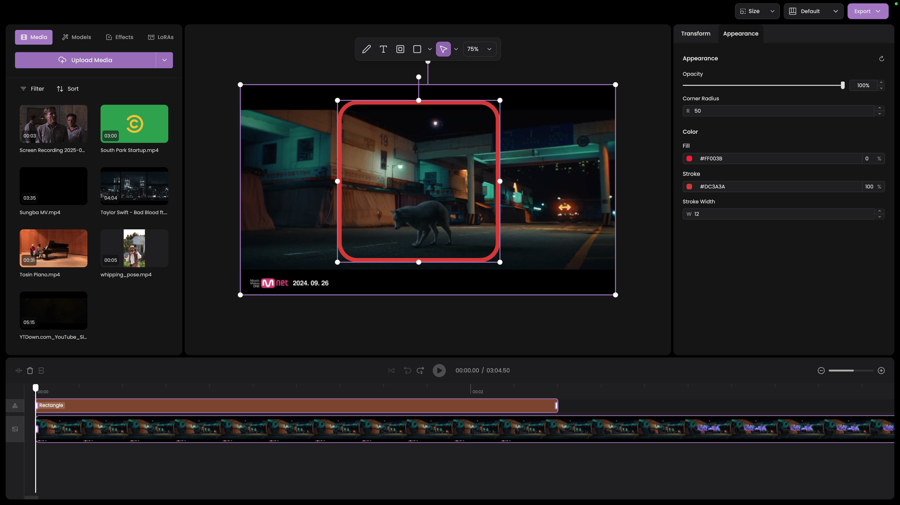

# Apex Studio

This is a video editor built with Electron, React and Typescript.

## Setup

### Cloning the Filters Repository

The CLUT filters are stored in a separate repository and need to be cloned separately. After cloning the main repository, run:

```bash
cd apex/packages/renderer/public
git clone https://github.com/totokunda/clut-filters.git filters
```

The filters folder contains two versions:

- `small/` - 512x512 PNG files for easy use and rendering
- `full/` - 1728x1728 PNG files for full quality

## Current Progress

Will be making progress on this as I go.


